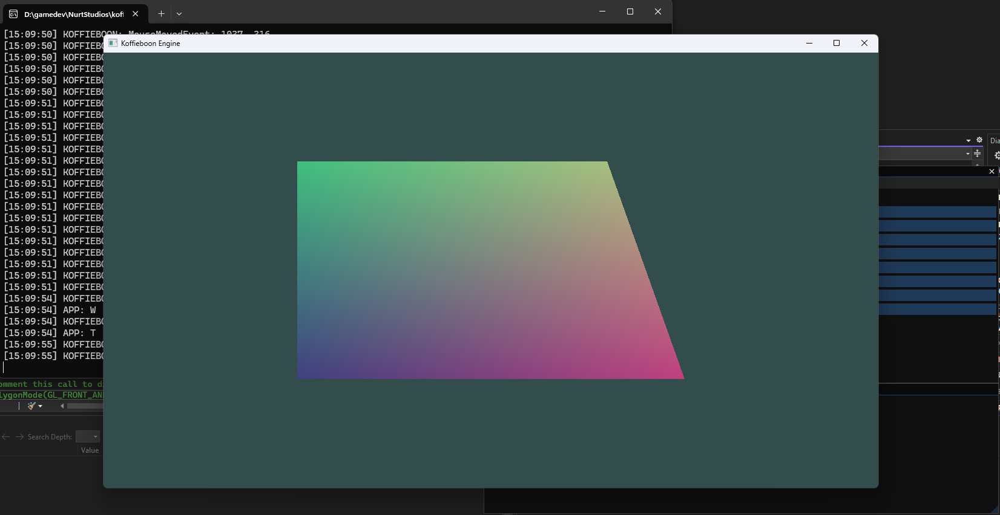
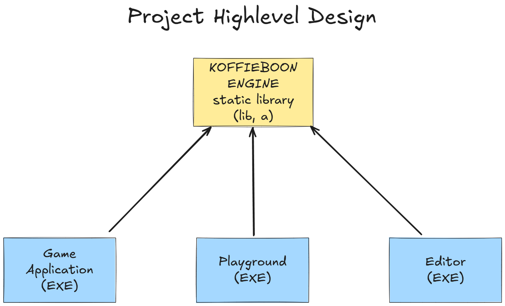
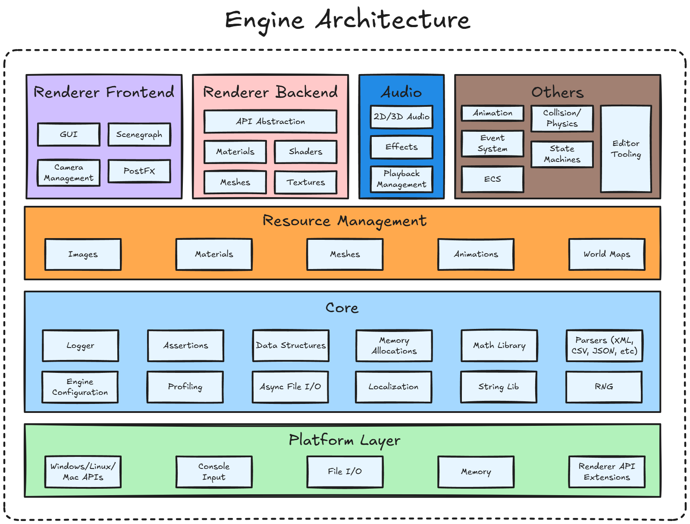
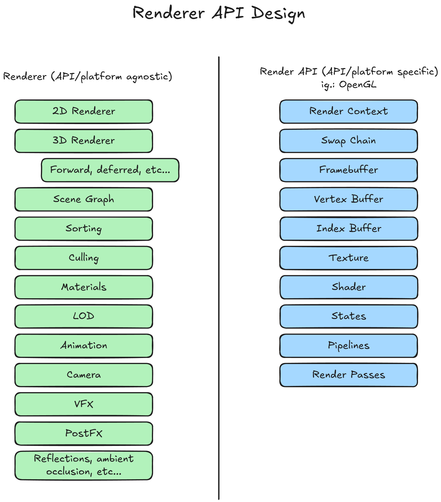

# Koffieboon Game Engine

This engine is made from the ground up using C++ and supporting OpenGL.

# What is the plan?

Koffieboon is a 3D engine from the start, with most of it built from scratch taking inspiration from different learning sources. My plan is to have to code very well commented and whatever other documentation I find relevant to make the understanding of the code easy and be used as a learning source also.

# High level design

# Engine Architecture

# Renderer API Design

# Roadmap Features list (Not an exhaustive list)

- [x] Build system
    - [x] CMake
    - [x] Build configuration for Debug, Release, etc.
    - [x] Build for Windows
- [x] Event System
    - [x] Window Events
    - [x] Application Events
    - [x] Input Events
- [ ] Low-level utilities (dynamic arrays, string handling, math utilities, etc.)
    - [x] Custom Types
    - [x] Math: Use glm
    - [ ] Standard Library Utilities: Use https://github.com/electronicarts/EASTL (Maybe)
- [ ] Platform Layer 
    - [x] Windowing
    - [x] Input
    - [x] ImGui (With Docking Branch)
    - [x] Engine Keycodes and Mouse codes
    - [ ] Console Interaction
- [x] Logging
- [ ] File I/O
- [ ] Application Layer
    - [ ] Game Loop
    - [ ] Calling the render loop
    - [ ] Updating the physics system
- [ ] Renderer/API Abstraction Layer
    - [ ] OpenGL -> **In Progress**
- [ ] Memory management
    - [ ] Custom allocator
    - [ ] Job system
    - [ ] Job system with dependency graph
- [ ] Scene Graph
    - [ ] Entity Component System
        - [ ] https://github.com/skypjack/entt
    - [ ] Scene Hierarchy
    - [ ] Scene Management
- [ ] Scripting
    - [ ] Lua
        - [ ] https://github.com/ThePhD/sol2
        - [ ] https://kunitoki.github.io/LuaBridge3/Manual.html
        - [ ] https://edw.is/using-lua-with-cpp/
- [ ] Physics System
    - [ ] Collision Detection
    - [ ] Rigid Body Dynamics
    - [ ] Soft Body Physics
    - [ ] Fluid Dynamics
- [ ] Profiling
    - [ ] Tracing
    - [ ] Profiling UI
- [ ] Asset Loading
    - [ ] Model Loading
    - [ ] Texture Loading
    - [ ] Animation Loading
- [ ] Audio
    - [ ] 2D/3D Sound
    - [ ] Music
    - [ ] Sound Effects 
- [ ] UI / Editor
    - [ ] ImGUI
    - [ ] https://avaloniaui.net/
- [ ] Animation
    - [ ] 2D Animation
    - [ ] 3D Animation
- [ ] Particle System

## Platform support

Windows is initially supported but linux and macOS are planned to be on the roadmap. Android and iOS runtime support might become part of it at some point.

## Goal

My initial goal is to create a game engine capable of making games.

My ultimate goal is to be able to use this engine to at least build a full game that can be published to a public platform like Steam or itch.io so other people can play it. And initially at least use the engine to participate in a couple of game jams with it.

But most importantly, I want to use this project as source of learning more about game development and game engine development.

### Contributing
**Pull requests are warmly welcome!!!**

For major changes, please [open an issue](https://github.com/joaoh82/koffieboon/issues/new) first and let's talk about it. We are all ears!

If you'd like to contribute, please fork the repository and make changes as you'd like and shoot a Pull Request our way!

**Please make sure to update tests as appropriate.**

If you feel like you need it go check the GitHub documentation on [creating a pull request](https://help.github.com/en/github/collaborating-with-issues-and-pull-requests/creating-a-pull-request).

### Code of Conduct

Contribution to the project is organized under the terms of the
Contributor Covenant, the maintainer of Koffieboon, [@joaoh82](https://github.com/joaoh82), promises to intervene to uphold that code of conduct.

### Contact

If you want to contact me you can reach me at <joaoh82@gmail.com>.

##### Inspiration And Sources
* https://github.com/stevinz/awesome-game-engine-dev?tab=readme-ov-file
* Vulkan Game Engine Series Written in C - https://www.youtube.com/playlist?list=PLv8Ddw9K0JPg1BEO-RS-0MYs423cvLVtj 
* The Cherno Game Engine Series - https://www.youtube.com/playlist?list=PLlrATfBNZ98dC-V-N3m0Go4deliWHPFwT
* https://lisyarus.github.io/blog/posts/so-you-want-to-make-a-game-engine.html#section-what-is-expected
* Book: Game Engine Architecture by Jason Gregory
* Book series: Foundations of Game Engine Development